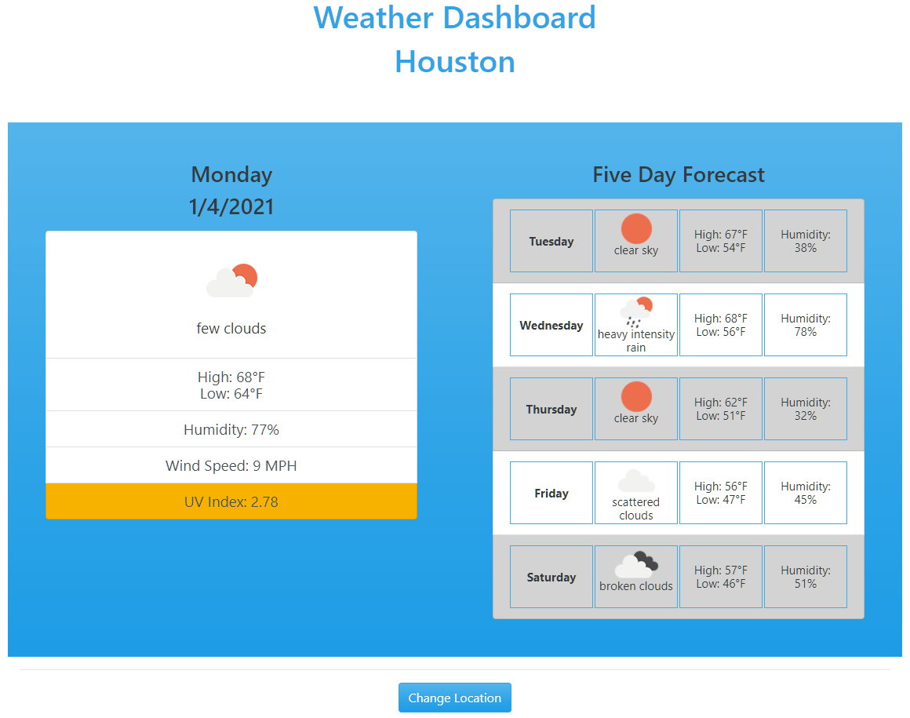

## Weather-Dashboard

## Description 

This app is a weather dashboard that will run in the browser and features dynamically updated HTML and CSS. It uses the OpenWeather API (https://openweathermap.org/api) to retrieve weather data for cities.

[Link to published website](https://jdavidrice.github.io/Weather-Dashboard/)

## Table of Contents

* [Description](#Description)
* [Table of Contents](#Table-of-Contents)
* [Photo](#Photo)
* [Installation](#Installation)
* [Usage](#Usage)
* [Credits](#Credits)
* [License](#License)
* [Contributing](#Contributing)

## Photo

* [Return to Top](#Weather-Dashboard)

## Installation

There is nothing to install to access the information on this website. 

* [Return to Top](#Weather-Dashboard)

## Usage 

This weather app can be used to find the current weather conditions and five-day forecast for any city in the world. Cities will be saved in local storage, so when the user reloads the page, the last city searched for will be displayed. The current weather conditions section includes a color-coded UV Index that is based on information from the [EPA](https://www.epa.gov/sunsafety/uv-index-scale-0). Cities are also saved as buttons in the "Change Location" section, and will allow the user to search again. The app is optimized for dark mode and is responsive to screen size. 

* [Return to Top](#Weather-Dashboard)

## Credits

Credit to Brad Traversy for his Udemy video course [Modern Javascript From the Beginning](https://www.udemy.com/course/modern-javascript-from-the-beginning/)

* [Return to Top](#Weather-Dashboard)

## License

No licenses

* [Return to Top](#Weather-Dashboard)

## Contributing

Jeremy Rice

* [Return to Top](#Weather-Dashboard)
