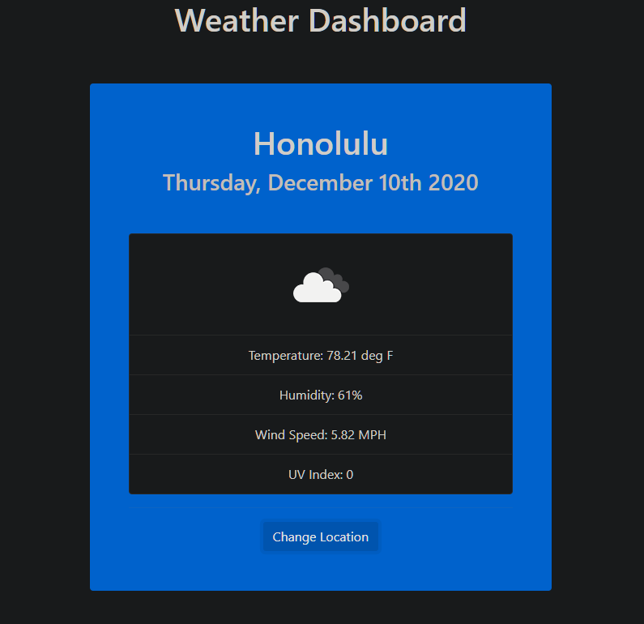

## Weather-Dashboard

## Description 

This app is a weather dashboard that will run in the browser and features dynamically updated HTML and CSS. It uses the OpenWeather API (https://openweathermap.org/api) to retrieve weather data for cities.

[Link to published website](https://jdavidrice.github.io/Weather-Dashboard/)

## Table of Contents

* [Description](#Description)
* [Table of Contents](#Table-of-Contents)
* [Photo](#Photo)
* [Installation](#Installation)
* [Usage](#Usage)
* [Credits](#Credits)
* [License](#License)
* [Badges](#Badges)
* [Contributing](#Contributing)
* [Tests](#Tests)

## Photo

* [Return to Top](#Weather-Dashboard)

## Installation

There is nothing to install to access the information on this website. 

* [Return to Top](#Weather-Dashboard)

## Usage 

Use this weather app to check the weather of your favorite cities. 

* [Return to Top](#Weather-Dashboard)

## Credits

Credit to Brad Traversy for his Udemy video course [Modern Javascript From the Beginning](https://www.udemy.com/course/modern-javascript-from-the-beginning/)

* [Return to Top](#Weather-Dashboard)

## License

No licenses

* [Return to Top](#Weather-Dashboard)

## Badges

No badges 

* [Return to Top](#Weather-Dashboard)

## Contributing

Jeremy Rice

* [Return to Top](#Weather-Dashboard)

## Tests

No tests

* [Return to Top](#Weather-Dashboard)